# Itch.io Pak for NextUI


[](https://ko-fi.com/carroarmato0)

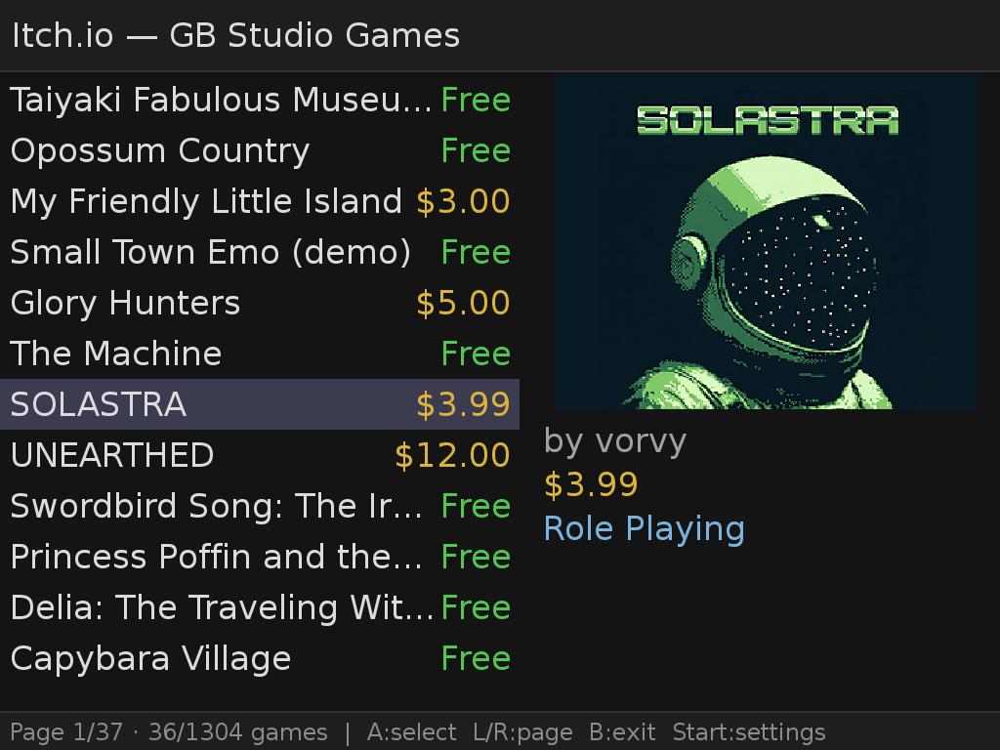

An unofficial community Pak for NextUI on TrimUI and Miyoo Flip handheld gaming
devices. Browse, discover, and download homebrew ROM games for Game Boy, Game
Boy Color, Game Boy Advance, NES/Famicom, Sega Genesis, and Pico-8 directly
from itch.io — all on-device, no PC required.

> **Disclaimer:** This is an unofficial community project, not affiliated with
> or endorsed by itch.io.

> **Content filters:** Built-in filters let you block or flag game detail pages
> by theme — adult content, queer content, heavy themes, and substance use.
> Adult Content, Heavy Themes, and Substance Use are on by default; Queer Content
> is opt-in. See [Content Filters](#content-filters) for details and limitations.

---

## Supported Devices

| Device | Platform code | Status |
|---|---|---|
| TrimUI Brick | `tg5040` | Tested |
| TrimUI Smart Pro | `tg5040` | Tested |
| TrimUI Smart Pro S | `tg5050` | Tested |
| Miyoo Flip | `my355` | Tested |

---

## Features

### Game browsing
- Scrollable list of homebrew ROM games sourced from multiple itch.io tag feeds, merged and deduplicated into a single catalogue covering Game Boy, Game Boy Color, Game Boy Advance, NES/Famicom, Sega Genesis, and Pico-8
- Live cover art thumbnails alongside the list with support for animated GIF cover art
- Pages of 36 games — D-pad automatically turns the page at the top or bottom of the list; D-pad Left/Right jumps pages directly
- On first launch the list loads live from the network while a full cache is built in the background
- On subsequent launches the full game list loads instantly from the on-device cache
- Cache auto-refreshes after 24 hours; manual refresh available in Settings
- Total game count displayed in the header
- Games already downloaded to the device are marked with a `[DL]` badge
- When a background check detects a new upstream file for a downloaded game, its badge changes to `[UP]` — press **X** from the game list to dismiss the notification
- If a downloaded game has been removed from itch.io (HTTP 404/410), its badge changes to `[!]` — press **X** to dismiss

### Sorting and filtering
Press **R1** (next) or **L1** (previous) from the game list to cycle through sort and filter modes. The cursor resets to the top of the list each time. The active mode is shown as a badge in the top-right corner of the header:

| Badge | Description |
|---|---|
| `[RSS]` | Feed order — newest from itch.io (default) |
| `[A-Z]` | Alphabetical ascending |
| `[Z-A]` | Alphabetical descending |
| `[NEW]` | By publication date, newest first |
| `[DL]` | Downloaded only — hides games not yet on device; pending-update games (`[UP]`) are grouped first, removed games (`[!]`) second, then the rest |
| `[FREE]` | Free games only |
| `[PAID]` | Paid games only |
| `[OWNED]` | Owned games only |

The selected sort mode is saved automatically and restored on the next launch.

### Game detail
- Cover art and screenshot gallery (L/R to browse); animated GIF cover art plays inline
- Game title, author, price or "Free" badge
- Scrollable description (plain text, converted from the game's HTML)
- QR code for every game — scan to open the itch.io page in a browser
- Download button (A) — disabled for paid games when no API key is set
- Downloaded files are listed with their on-device paths; press **Y** to manage, delete, or toggle title-based filename for the game
- Game titles and descriptions in non-Latin scripts render correctly — the bundled font set covers Arabic, Cyrillic, Devanagari, Hebrew, Japanese/CJK, and Thai automatically, with no configuration required

### Downloading
- Download free games without an itch.io account
- Download paid games you already own using your itch.io API key
- When a game has multiple ROM files, a file picker is shown
- Progress bar with live percentage and downloaded/total size
- Files saved directly to the correct ROM folder:
  - `.gb` → `Roms/Game Boy (GB)/`
  - `.gbc` → `Roms/Game Boy Color (GBC)/`
  - `.gba` → `Roms/Game Boy Advance (GBA)/`
  - `.nes` → `Roms/Nintendo Entertainment System (FC)/`
  - `.md` / `.gen` / `.smd` → `Roms/Sega Genesis (MD)/`
  - `.p8` / `.p8.png` → `Roms/Pico-8 (P8)/` or `Roms/Pico-8 (PICO)/` depending on the configured **Pico-8 Core** (see Settings)
- Multi-file Pico-8 games (games that ship as several `.p8` carts) are extracted into their own subdirectory inside the Pico-8 ROM folder, preserving the relative paths from the ZIP
- When **ROM Location** is set to `ask`, a directory browser lets you choose the destination folder before each download; the last chosen path is remembered per file type
- On download failure, a QR code is shown so you can try from a browser
- **Bundle purchases** — if you own a game both individually and as part of one or more itch.io bundles, a purchase picker lists each transaction (labelled `Individual purchase` or `Bundle: <name>`) so you can choose which to download from

### Game management
- Downloaded games are tracked in an on-device inventory
- From the game detail screen, press **Y** to delete downloaded ROMs:
  - Single-file games show a confirmation prompt with the filename and path
  - Multi-file games open a **Manage Downloads** screen where you can delete files individually or all at once with **Delete all**
- After deletion the `[DL]` badge is removed and the Download button becomes available again

### Unified naming
When **Use game title as filename** is enabled (the default), downloaded ROMs are automatically renamed to match the game's title on itch.io. For example, a file named `gb-studio-export.gb` becomes `Doomslinger Dungeon.gb`.

- **Global toggle** — in Settings, **Use game title as filename** turns the feature on or off for all future downloads
- **Per-game toggle** — press **Y** from a game's detail screen to enable or disable title-based naming for that specific game; this option appears only when a download exists and the global toggle is on
  - Multi-file games have a **Use game title as filename** toggle row at the bottom of the **Manage Downloads** screen
- When toggling a game that already has a ROM on device, a guided flow offers to rename the existing file and — if save data is detected — rename the matching SRAM save and save states at the same time
  - Saves and states can be renamed or skipped independently; skipped files are left at their original paths and will need to be renamed manually before the emulator can load them
- If two different games produce the same sanitised filename, a ` (2)` suffix is appended automatically to avoid collisions

### Content filters
- **Adult Content**, **Heavy Themes**, and **Substance Use** are **on by default**.
  **Queer Content** is opt-in (off by default).
- **Adult Content** — per-tag filter covering explicit and suggestive content
  (nudity, gore, innuendo, and similar).
- **Queer Content** — per-tag filter for LGBTQ+ themes and representation.
- **Heavy Themes** — per-tag filter for potentially distressing narrative topics
  (grief, loss, suicide, trauma, abuse, and similar).
- **Substance Use** — single toggle for drug and alcohol themes.
- When a filter triggers, a full-screen **Content Warning** cover replaces the
  detail view. Press **B** to go back or **Start** to open Settings and adjust
  your filters.
- Filters are configured in **Settings** (press Start from any screen).

### Power management

The power button behaves the same way it does with emulators on NextUI:

- **Short press** — device goes to sleep; the Pak stays in memory and resumes exactly where you left it when you wake the device.
- **Hold 2 seconds** — device shuts down cleanly.

If a background task (ROM download, game list cache build, inventory check) is running when you press the power button, a full-screen **"Please wait"** overlay is shown until the task finishes. The action fires automatically — no confirmation or extra button press needed.

### Settings
- **API Key** — shows `WORKING` (green) when an itch.io API key is configured and working, enabling paid game downloads. Selecting the row when no key is set opens an in-app overlay with a QR code linking to the setup instructions
- **ROM Selection mode** — `auto` (best file chosen automatically) or `ask` (always show picker)
- **ROM Location** — `auto` (saves to the default folder for the file type) or `ask` (directory browser shown before each download; remembers last path per file type)
- **Pico-8 Core** — selects which Pico-8 emulator downloaded `.p8` / `.p8.png` files are destined for:
  - `FakeO8 (default)` — saves to `Roms/Pico-8 (P8)/`, used by NextUI's built-in FakeO8 core
  - `Pico-8 (official)` — saves to `Roms/Pico-8 (PICO)/`, used by the [minui-pico-8-pak](https://github.com/josegonzalez/minui-pico-8-pak) which requires a paid copy of Pico-8

  Switching cores instantly moves all previously downloaded Pico-8 files (ROMs and cover art) to the new folder — no manual file management needed. Switching back moves them back.
- **Use game title as filename** — when `ON` (default), downloaded ROMs are renamed to match the itch.io game title; set to `OFF` to keep the original upload filename
- **Log Level** — `Info` (default) records key events and all errors. Set to `Debug` to capture the full HTTP request/response flow — useful when reporting a bug involving a download failure or a feed that won't load. The log file is written to `.userdata/<platform>/logs/itchio-pak.log` on the SD card.
- **Clear Image Cache** — removes cached cover art from `/tmp`
- **Refresh Game List** — re-fetches the full game list from itch.io across all platform feeds with a live progress screen showing how many games have been retrieved; the cache is updated on completion. Press **B** at any time to cancel the fetch cleanly — no partial cache is written
- **Update Inventory** — manually triggers a background check for new upstream files, removed games, and missing cover art across all inventory entries; the right side of the row shows when the last check ran (`just now`, `Xm ago`, `Xh ago`, or `Xd ago`) or `never` if no check has run yet
- **Content Moderation** — configure per-category content filters
- **About** — app description, version, and QR code linking to the project page

### Controls

| Button | Action |
|---|---|
| D-pad up/down | Navigate list / scroll detail page |
| D-pad up/down (hold) | Auto-scroll with acceleration |
| D-pad down (at last item) | Advance to next page |
| D-pad up (at first item) | Go back to previous page (lands on last item) |
| D-pad left / right | Jump one page forward/back in game list |
| D-pad left / right | Previous/next screenshot in detail view |
| L / R shoulder | Cycle sort mode backward/forward (game list); cursor resets to top |
| L / R shoulder | Previous/next screenshot in detail view |
| A | Select / confirm / download |
| B | Back |
| Y | Manage / delete downloaded ROMs, or toggle title-based filename (game detail screen) |
| X | Dismiss update (`[UP]`) or removal (`[!]`) notification for the selected game |
| Start | Open Settings from any screen |
| Power (short press) | Sleep — resumes at the same screen on wake |
| Power (hold 2 s) | Shutdown — waits for active tasks to finish first |

---

## Installation

There are two release files on the [Releases](../../releases) page. Both support
all devices — the difference is the directory structure inside:

| File | What's inside | Use when |
|---|---|---|
| `Itch-io.pak.zip` | Pak files only (no folder wrapper) | Pak Store install, or manual install where you place it in the right platform folder yourself |
| `Itch-io.pakz` | Full `Tools/<platform>/Itch-io.pak/` tree | Manual install — extract to SD card root and all platforms are set up at once |

### Via the Pak Store (recommended)

Open the Pak Store on your device, find **Itch-io**, and press **A** to install.
The Pak Store downloads and installs `Itch-io.pak.zip` automatically.

### Manual install — `Itch-io.pak.zip`

Use this if you want to install without the Pak Store and prefer to place files
yourself.

1. Download `Itch-io.pak.zip` from the [Releases](../../releases) page.
2. Create the destination folder on your SD card for your device:
   - TrimUI Brick / Smart Pro: `Tools/tg5040/Itch-io.pak/`
   - TrimUI Smart Pro S: `Tools/tg5050/Itch-io.pak/`
   - Miyoo Flip: `Tools/my355/Itch-io.pak/`
3. Extract the contents of the zip **into** that folder (the folder should contain
   `launch.sh`, `itchio-pak`, `pak.json`, etc. directly — not a nested subfolder).
4. Reinsert the SD card and boot into NextUI — **Itch-io** will appear in Tools.
5. Connect to WiFi before launching.

### Manual install — `Itch-io.pakz` (all platforms at once)

Use this if you want to set up all supported platforms in one step, or if you
are preparing an SD card that will be used across multiple device types.

1. Download `Itch-io.pakz` from the [Releases](../../releases) page.
2. Rename it to `Itch-io.pakz.zip` (most tools require a `.zip` extension to extract).
3. Extract the contents directly to the **root** of your SD card. The archive
   already contains the correct `Tools/<platform>/Itch-io.pak/` structure.
4. Reinsert the SD card and boot into NextUI — **Itch-io** will appear in Tools.
5. Connect to WiFi before launching.

---

## Screenshots

<table>
  <tr>
    <td align="center">
      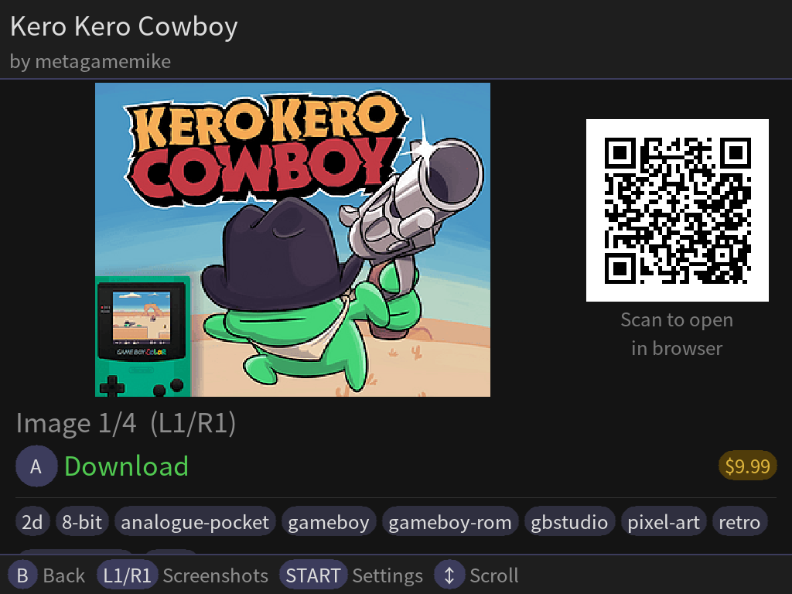<br/>
      <sub>Game detail — cover art, screenshots, QR code and description</sub>
    </td>
    <td align="center">
      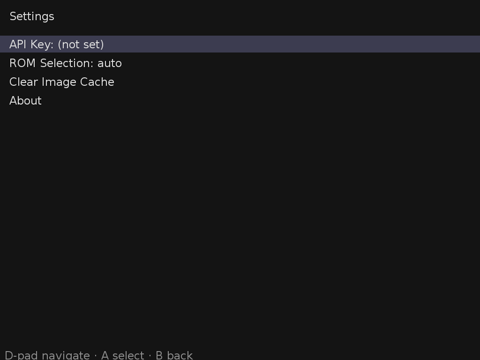<br/>
      <sub>Settings — API key, ROM selection mode, cache management</sub>
    </td>
  </tr>
  <tr>
    <td align="center">
      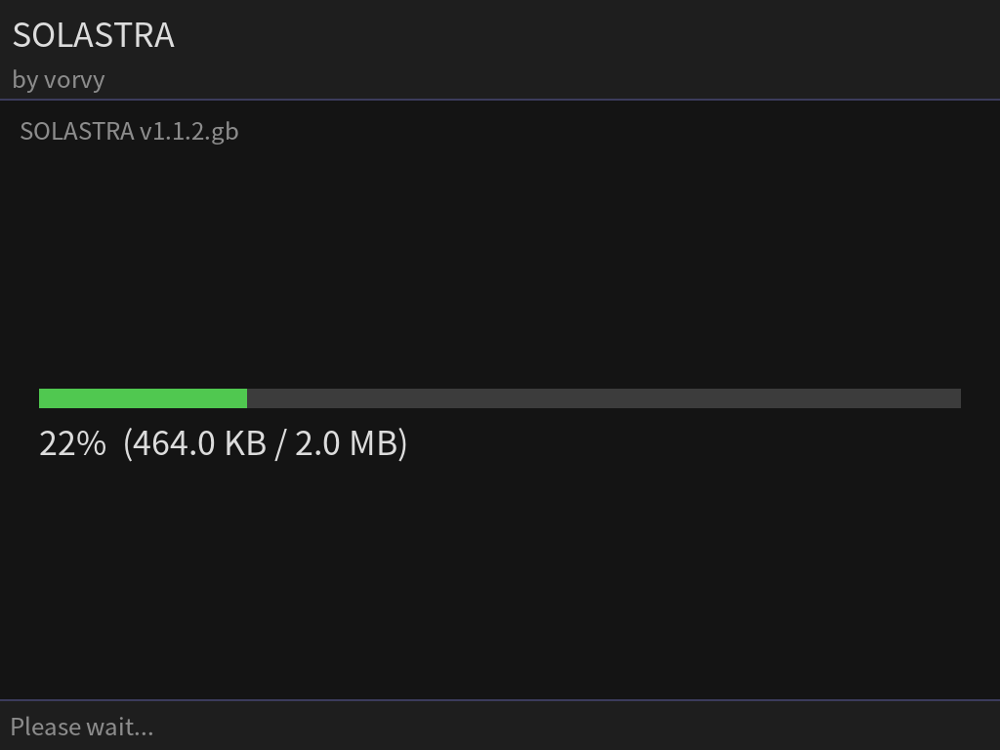<br/>
      <sub>Download — progress bar with live percentage and size</sub>
    </td>
    <td align="center">
      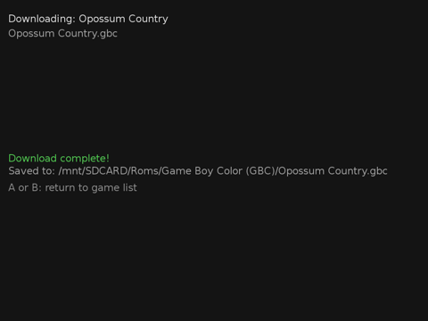<br/>
      <sub>Download complete — saved path shown, ready to play</sub>
    </td>
  </tr>
  <tr>
    <td align="center">
      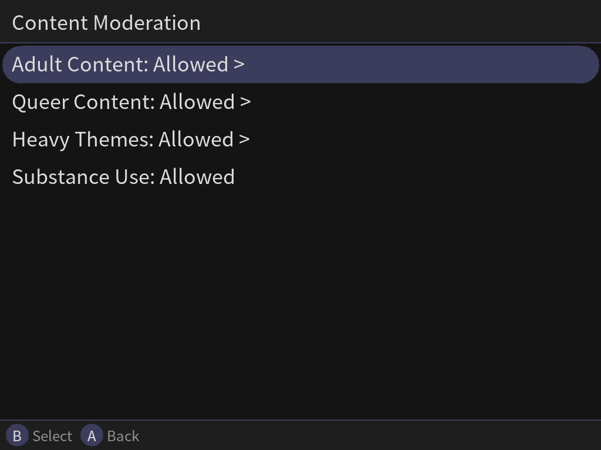<br/>
      <sub>Content Moderation — per-category filter toggles in Settings</sub>
    </td>
    <td align="center">
      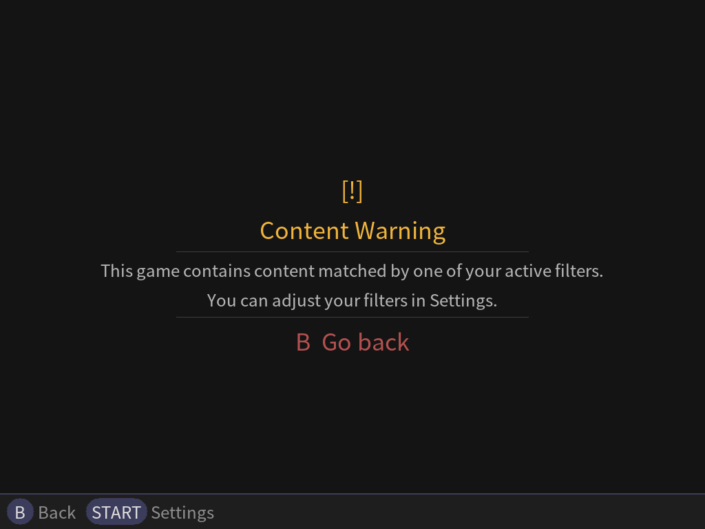<br/>
      <sub>Content Warning — shown instead of detail view when a filter triggers</sub>
    </td>
  </tr>
  <tr>
    <td align="center">
      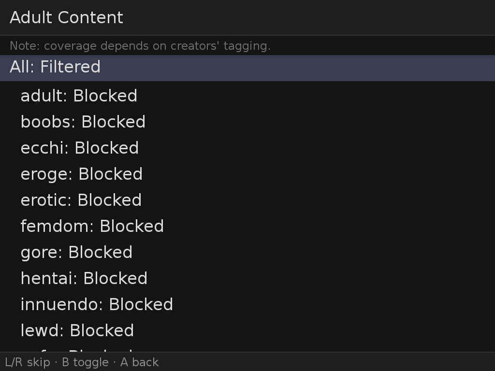<br/>
      <sub>Adult Content filter — per-tag toggles</sub>
    </td>
    <td align="center">
      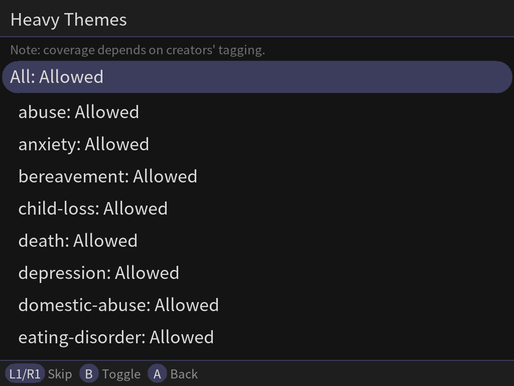<br/>
      <sub>Heavy Themes filter — per-tag toggles</sub>
    </td>
  </tr>
  <tr>
    <td align="center">
      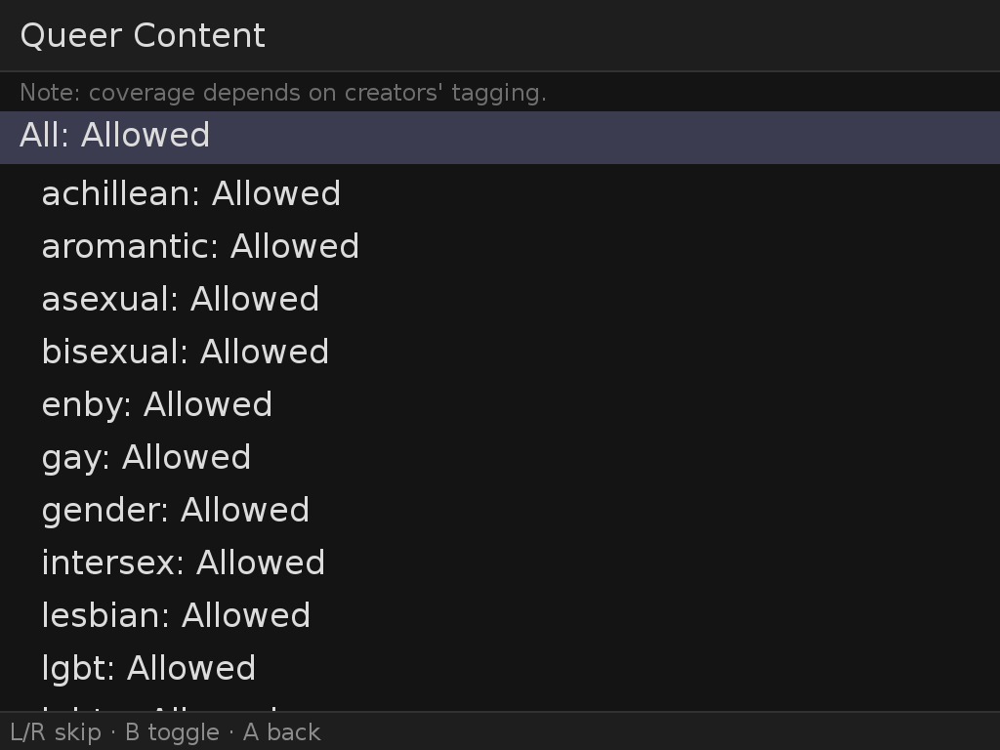<br/>
      <sub>Queer Content filter — per-tag toggles</sub>
    </td>
    <td align="center">
      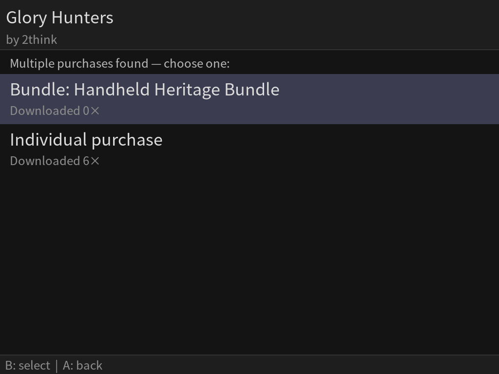<br/>
      <sub>Bundle purchase picker — choose which transaction to download from</sub>
    </td>
  </tr>
  <tr>
    <td align="center">
      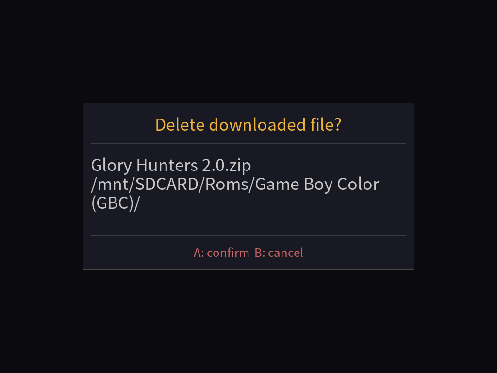<br/>
      <sub>Delete confirmation — shown before removing a ROM from the device</sub>
    </td>
  </tr>
</table>

---

## itch.io API Key (paid games)

Free games can be downloaded without any account or API key.

To download paid games you already own, you need to configure your itch.io
API key. The Settings screen shows **FOUND** (green) when a key is active.

### Generating your API key

1. Log in to itch.io in a browser.
2. Go to <https://itch.io/user/settings/api-keys>.
3. Click **Generate new API key** and copy the key.

### Adding the key to the Pak

The Pak does not include an on-screen keyboard, so the key is set by editing
the config file directly. The config file is at
`.userdata/shared/Itch-io/config.json` on the SD card.

> **Warning:** The config file also stores your ROM selection mode, ROM
> location, content filter preferences, and other settings. Any method that
> writes the entire file from scratch will overwrite those values. The options
> below show how to add or update only the `api_key` field safely.

#### Option 1 — Browser-based file manager (recommended)

With your device connected over USB, open
**[https://dashboard.loveretro.games/](https://dashboard.loveretro.games/)**
in a browser. Use the built-in file manager to navigate to
`.userdata/shared/Itch-io/config.json` and edit the file directly — no
command line required, and only the fields you change are affected.

#### Option 2 — SD card

1. Power off the device and remove the SD card.
2. Open `.userdata/shared/Itch-io/config.json` in a text editor.
3. Add or update the `"api_key"` field, leaving all other fields untouched.
4. Save, reinsert the SD card, and boot.

#### Option 3 — ADB (pull → edit → push)

```sh
# Download the current config to your computer
adb pull /mnt/SDCARD/.userdata/shared/Itch-io/config.json config.json

# Open config.json in a text editor, add or update the "api_key" field:
#   "api_key": "YOUR_API_KEY_HERE"
# Leave all other fields unchanged, then push the file back:
adb push config.json /mnt/SDCARD/.userdata/shared/Itch-io/config.json
```

If you have never launched the Pak and no config file exists yet, you can
create one from scratch — just make sure to include any other settings you
want alongside the key (or leave them out to accept defaults):

```json
{
  "api_key": "YOUR_API_KEY_HERE"
}
```

---

Restart the Pak after saving — the Settings screen will show **API Key: FOUND**
once the key is loaded.

---

## Content Filters

The pak includes a built-in content filter system. Filters are useful for anyone
who wants to be aware of — or avoid — specific themes before opening a game,
whether that is someone who prefers not to encounter certain content
unexpectedly, or a parent managing what their child encounters.

When a game's tags match an active filter, a **Content Warning** screen replaces
the detail view. Press **B** to go back, or **Start** to open Settings and adjust
your filters.

### Configuring filters

Press **Start** from any screen to open **Settings**, then scroll to the content
filter section. Each category can be toggled independently:

- **Adult Content** — covers explicit and suggestive material (nudity, gore,
  innuendo, and similar). Supports per-tag control. Defaults to **on**.
- **Heavy Themes** — covers potentially distressing narrative content: grief,
  loss, suicide, trauma, abuse, and similar. Supports per-tag control.
  Defaults to **on**.
- **Substance Use** — covers drug and alcohol themes. Defaults to **on**.
- **Queer Content** — covers LGBTQ+ themes and representation. Supports
  per-tag control so you can allow some topics while filtering others.
  Defaults to **off** (opt-in).

The specific tags covered by each category are listed and togglable directly
in the Settings screen on the device.

### Limitations

> **Filtering is best-effort, not comprehensive.** Be aware of the following:

- **Tag-based only** — itch.io has no machine-readable content rating system.
  Filtering relies entirely on tags that game creators choose to apply. A
  creator can omit tags or use non-standard wording, and content will not be
  caught.
- **Scrape-time only** — tags are fetched when a game's detail page is opened.
  The game list is always unfiltered; cover art alone may hint at content.
- **Curated tag list** — the filter covers known tags but the list is not
  exhaustive. New or community-specific tags may not be included until a
  future update.
- **No substitute for awareness** — filters reduce unexpected encounters but
  cannot guarantee coverage. When in doubt, check the game's itch.io page
  directly.

---

## Known Limitations / To-Do

- **Cloudflare may block RSS feed requests (HTTP 403).** itch.io is protected by
  Cloudflare, which uses browser fingerprinting to detect bot traffic. Despite the
  app mimicking Chrome headers and TLS fingerprint, Cloudflare may still issue a
  temporary block — especially on networks or IP ranges it has not seen before.

  **What you will see:** An error message on the game list or cache-refresh screen
  that reads *"Cloudflare blocked the request (HTTP 403)"*.

  **What you can do:**
  1. **Visit itch.io in a browser on the same WiFi network.** Your device and your
     phone or laptop share the same public IP address. If Cloudflare presents a
     human-verification challenge in the browser and you pass it, the IP is marked
     as human traffic. Return to the Pak and press **A** (game list) or retry the
     refresh — it will often succeed immediately afterwards.
  2. **Wait a few minutes and retry.** Cloudflare challenges are sometimes
     temporary. The Pak retries the request each time you press **A** on the error
     screen.
  3. **Try a different network.** Switching WiFi networks (e.g. a mobile hotspot)
     gives the Pak a fresh public IP that may not be challenged.

- **No in-app keyboard for API key entry.** The API key must be set by editing
  `config.json` directly (see [itch.io API Key](#itch-io-api-key-paid-games)).

- **Animated GIF thumbnail conversion is best-effort.** When a game's cover art
  is an animated GIF, a static PNG thumbnail is derived from it automatically
  using a colour-variance heuristic (the frame with the most colour diversity is
  chosen). The result depends on how the game developer structured the GIF — a
  GIF that opens on a black frame, uses unusual disposal methods, or has few
  visually distinct frames may still produce a poor thumbnail.

- **`.pocket` and other non-ROM files** are filtered out — only `.gb`, `.gbc`,
  `.gba`, `.nes`, `.md`, `.gen`, `.smd`, `.p8`, and `.p8.png` files are shown.

- **No search** — the game list is sourced from multiple itch.io tag feeds
  (one per platform) combined in itch.io's default sort order. There is no
  free-text search.

- **CSRF token expiry** — if the ROM picker is left open for a long time before
  selecting a file, the resolver may reject the request. Back out and
  re-initiate the download.

- **Free download scraping is brittle** — itch.io can change its page structure
  without notice, which would break the free download flow. The paid API path
  is more stable.

- **"Pay What You Want" games with a mandatory minimum price show as free.**
  itch.io reports a price of `0` in its RSS feed for games configured as
  "name your price", even when the creator has set a non-zero minimum purchase
  amount. The Pak cannot distinguish these from genuinely free games using feed
  data alone, so they are labelled **Free** and appear in the `[FREE]` filter.
  You can recognise them on itch.io by their **"Download Now"** button (instead
  of "Buy Now") and a note that a minimum purchase price is required. If you
  attempt to download one without owning it, the download will fail and a QR
  code will be shown so you can complete the purchase in a browser first.

- **Unified naming and save format changes** — the save/state migration flow reads your current `saveFormat` and `stateFormat` settings from `minuisettings.txt` at the time of migration. If you later change the save format in NextUI's settings, existing saves and states will not be automatically re-migrated to the new naming scheme. You would need to rename them manually or re-run the per-game toggle to trigger the flow again.

---

## Development

### Requirements

- Go 1.22+
- Docker or Podman (for cross-compilation)
- `libsdl2-dev`, `libsdl2-ttf-dev`, `libsdl2-image-dev` (for native headless builds)

### Common commands

```bash
# Run tests (headless, in container)
make test

# Build native binary (requires local SDL2 dev libs)
make build-native

# Cross-compile for all supported platforms
make build-all

# Assemble release zips in dist/
make release

# Deploy to a connected device over ADB
make deploy-adb

# Stream the live log from the device
make debug-logs
```

### Build tags

- `headless` — disables SDL2 rendering; used for CI and unit tests

### Project layout

```
cmd/itchio-pak/       — main binary entry point
internal/
  itchio/             — itch.io client: RSS feed, page scraping, download flow
  power/              — power button detection via evdev; sleep/shutdown callback
  renderer/           — SDL2 drawing layer, image cache, QR code generation
  roms/               — ROM type detection, destination folder mapping
  settings/           — JSON config read/write
  ui/                 — screen-based UI (list, detail, fetch, ROM picker, download, settings)
lib/{tg5040,my355}/   — bundled SDL2 .so files (tg5050 shares tg5040's libs)
docs/                 — interaction flow reference and screenshots
scripts/              — build, test, release, deploy, debug, screenshot helpers
docker/               — cross-compilation container image
assets/               — font.ttf, CA certificate bundle
testdata/             — captured HTML/RSS fixtures for offline unit tests
```

For a detailed explanation of how the itch.io web API is used, see
[`docs/itchio-interaction-flow.md`](docs/itchio-interaction-flow.md).

### Contributing

1. Fork the repository and create a feature branch.
2. Make your changes and ensure `make test` passes.
3. Open a pull request — CI will run automatically.
