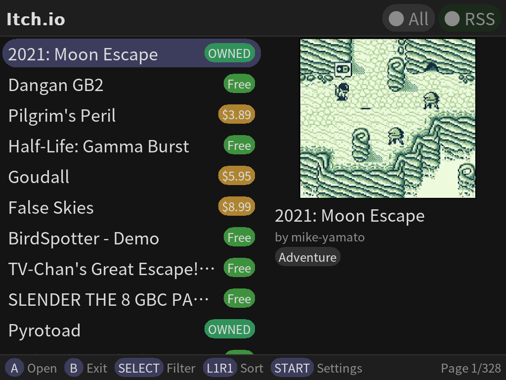
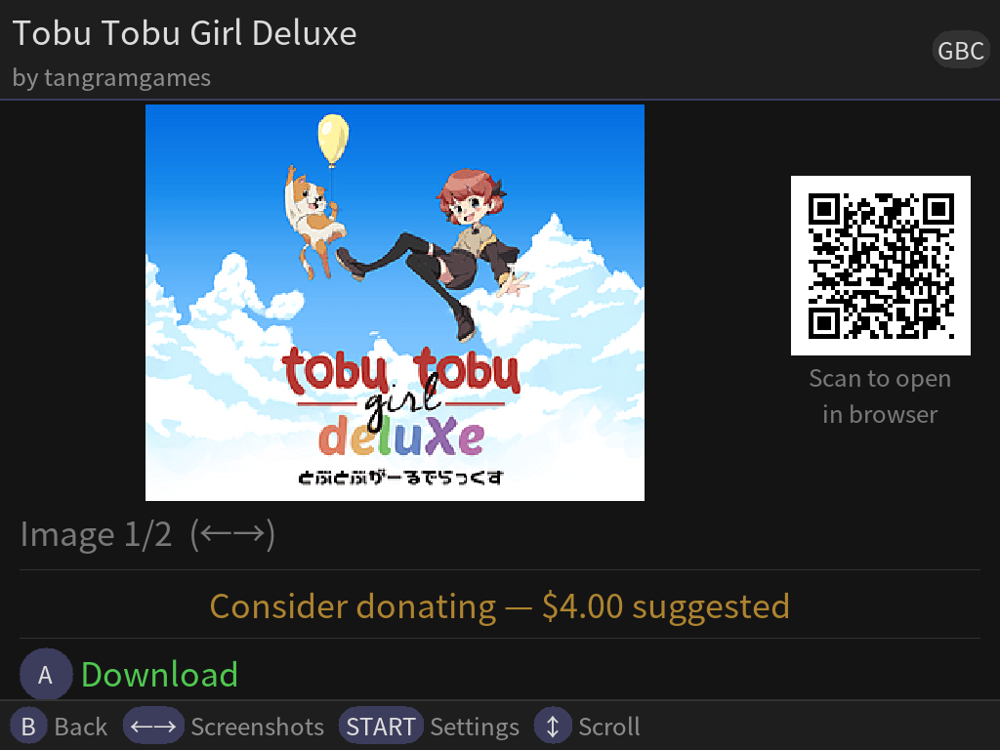
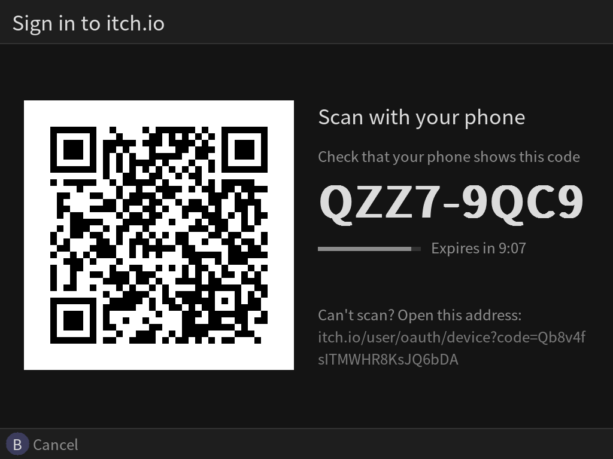
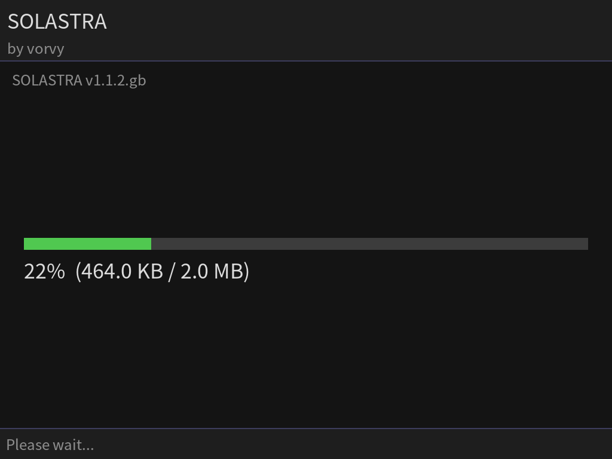
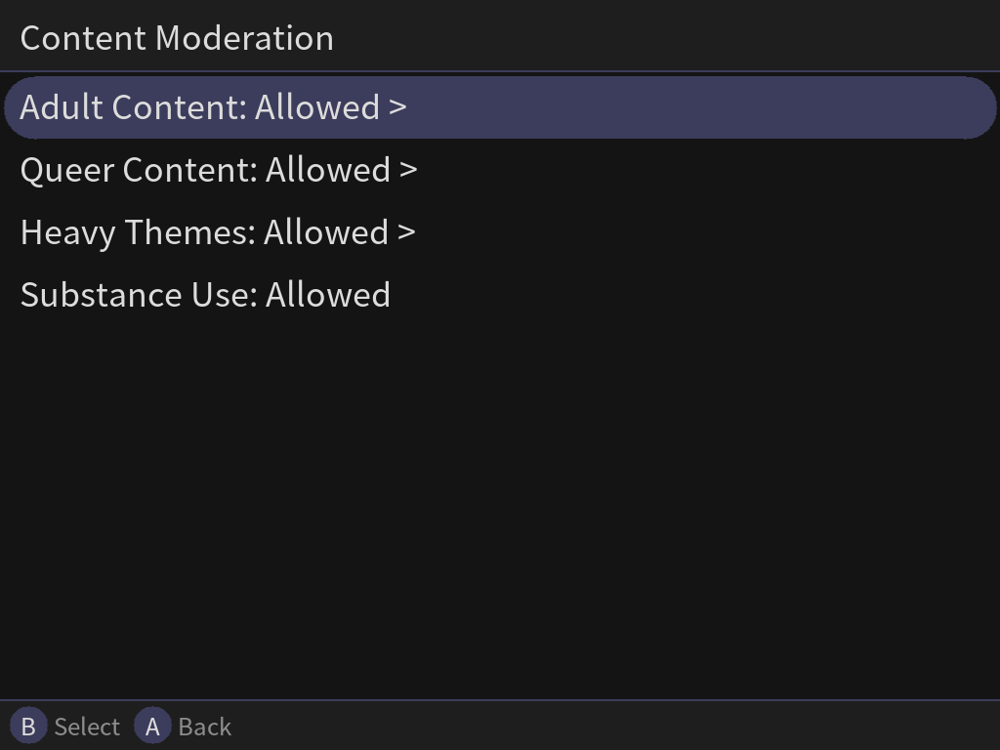
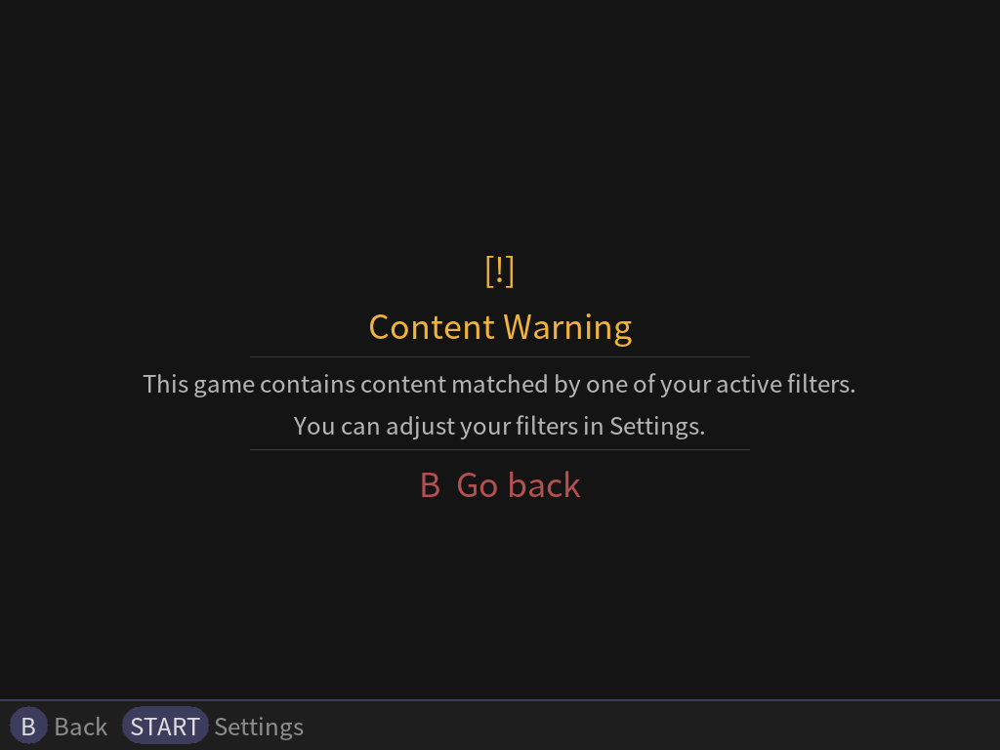

# Itch-io — browse and download itch.io games on your handheld

An unofficial community app for **NextUI** and **muOS** on TrimUI and Miyoo Flip
handheld gaming devices. Browse, discover, and download homebrew ROM games for
Game Boy, Game Boy Color, Game Boy Advance, NES/Famicom, Sega Genesis, and
Pico-8 directly from itch.io — all on-device, no PC required.

> **Disclaimer:** This is an unofficial community project, not affiliated with
> or endorsed by itch.io.

---

## Install

**NextUI, with the Pak Store:** find **Itch-io** and press **A**. Done.

**Everything else** — manual NextUI installs, muOS, and the full device list —
is in the [installation guide](docs/install.md).

| Firmware | Devices |
|---|---|
| NextUI | TrimUI Brick, Smart Pro, Smart Pro S, Miyoo Flip, Anbernic RG XX family |
| muOS | Every muOS device (one ARM64 build) |

Connect to WiFi before launching.

---

## What it does

- **Browse thousands of homebrew games** from itch.io, merged from multiple tag
  feeds into one catalogue — GB, GBC, GBA, NES, Genesis and Pico-8
- **Download straight to the right ROM folder**, with cover art, so games are
  ready to play without touching a PC
- **Search, sort and filter** by platform, name, date, or whether you own or
  have already downloaded a game
- **Paid games are listed for everyone**, and the ones you own download too:
  [sign in with your phone](docs/sign-in.md) by scanning a QR code — nothing to type
- **Name-your-own-price games show the developer's suggested amount**, so you
  can decide whether to support them
- **Tracks what you have downloaded** and flags games with updates (`[UP]`) or
  that vanished from itch.io (`[!]`)
- **Renames files to the game's real title**, so `gb-studio-export.gb` becomes
  `Doomslinger Dungeon.gb` — saves and save states can follow
- **Follows your NextUI colour palette**, including light themes
- **Content filters** for adult, heavy, substance and queer themes — the first
  three on by default, queer content opt-in
- **Keeps working when Wi-Fi drops** — cached games and covers stay usable, an
  `Offline` chip says why nothing new arrives, and everything picks up by itself
  when the connection is back
- **Tells you when a new version is out**, with a small notice and
  **Settings → App updates** — Stable or release-candidate channel. On muOS it
  can save the update for Archive Manager to install
- **Sleeps and resumes** with the power button, like any emulator

The [feature reference](docs/features.md) covers all of it in detail, including
the caveats.

---

## Controls

| Button | Action |
|---|---|
| D-pad up/down | Navigate list / scroll detail page / move through Settings |
| D-pad up/down (hold) | Auto-scroll with acceleration |
| D-pad left / right | Jump one page forward/back in game list; previous/next screenshot in detail view |
| L1 / R1 (game list, A-Z mode) | Jump to previous/next letter boundary |
| L1 / R1 (game list, other modes) | Cycle sort mode backward/forward |
| L1 / R1 (Settings) | Jump to the previous/next section |
| A | Select / confirm / download |
| B | Back / cancel (also cancels a Save to ARCHIVE download) |
| X | Dismiss update (`[UP]`) or removal (`[!]`) notification for the selected game |
| Y | Manage / delete downloaded ROMs, or sign out in Settings |
| SELECT | Open Filter &amp; Search overlay (game list) |
| Start | Open Settings from any screen |
| Power (short press) | Sleep — resumes at the same screen on wake |
| Power (hold 2 s) | Shutdown — waits for active tasks to finish first |

---

## Documentation

| Guide | Covers |
|---|---|
| [Installation](docs/install.md) | Every install method, supported devices, NextUI vs muOS differences |
| [Feature reference](docs/features.md) | Everything the app does, and the limits of each feature |
| [Signing in](docs/sign-in.md) | Sign in with a QR code to download paid games you own |
| [App updates](docs/features.md#app-updates) | The update notice, channels, the Pak Store and muOS Save to ARCHIVE |
| [Development](docs/development.md) | Building, testing, releasing, project layout, contributing |

---

## Screenshots

<table>
  <tr>
    <td align="center">
       
      Game detail — cover art, screenshots, QR code and the developer's suggested donation
    </td>
    <td align="center">
       
      A paid game you don't own — its price, and a QR code to buy it on itch.io
    </td>
  </tr>
  <tr>
    <td align="center">
       
      Settings — grouped into sections, values on the right; L1/R1 jump between sections
    </td>
    <td align="center">
       
      Sign in — scan the QR code with your phone and check the code matches
    </td>
  </tr>
  <tr>
    <td align="center">
       
      Update notice — shown once per new version, top right
    </td>
    <td align="center">
       
      App updates — channel, check now, and the release notes as a QR code
    </td>
  </tr>
  <tr>
    <td align="center">
       
      Filter &amp; Search — platform, sort mode, and free-text search in one overlay
    </td>
    <td align="center">
       
      Download — progress bar with live percentage and size
    </td>
  </tr>
  <tr>
    <td align="center">
       
      Content Moderation — per-category filter toggles in Settings
    </td>
    <td align="center">
       
      Content Warning — shown instead of detail view when a filter triggers
    </td>
  </tr>
</table>

The same screen under four NextUI palettes — Catppuccin Macchiato, Catppuccin Latte, Catppuccin Mocha and Teal Powder

---

## Support

Found a bug, or got an Anbernic RG XX to test on? [Open an issue](../../issues) —
H700 reports are especially welcome, since nobody working on Itch-io owns one.

If you find this useful, you can [buy me a coffee](https://ko-fi.com/carroarmato0).
