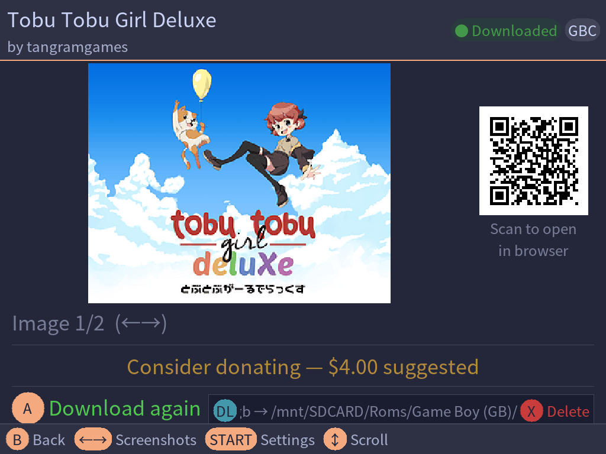

# Feature reference

[← Back to the README](../README.md)

The complete feature list, with the caveats for each feature next to it rather
than collected at the end.

---

## Game browsing

- Scrollable list of homebrew ROM games sourced from multiple itch.io tag feeds, merged and deduplicated into a single catalogue covering Game Boy, Game Boy Color, Game Boy Advance, NES/Famicom, Sega Genesis, and Pico-8
- Live cover art thumbnails alongside the list with support for animated GIF cover art
- Pages of 36 games — D-pad automatically turns the page at the top or bottom of the list; D-pad Left/Right jumps pages directly
- On first launch the list loads live from the network while a full cache is built in the background
- On subsequent launches the full game list loads instantly from the on-device cache
- Cache auto-refreshes after 24 hours; manual refresh available in Settings
- Total game count displayed in the header
- Games already downloaded to the device are marked with a `[DL]` badge
- When a background check detects a new upstream file for a downloaded game, its badge changes to `[UP]` — press **X** from the game list to dismiss the notification
- If a downloaded game has been removed from itch.io (HTTP 404/410), its badge changes to `[!]` — press **X** to dismiss

> **Animated GIF thumbnails are best-effort.** When a game's cover art is an
> animated GIF, a static PNG thumbnail is derived from it using a colour-variance
> heuristic (the frame with the most colour diversity wins). A GIF that opens on
> a black frame, uses unusual disposal methods, or has few visually distinct
> frames may still produce a poor thumbnail.

---

## Sorting, filtering and search

Press **SELECT** from the game list to open the **Filter & Search** overlay. From there you can:

- **Platform** — show games for a specific system (All, GB, GBC, GBA, NES, MD, Pico-8) or all at once
- **Sort** — choose a sort mode:

  | Mode | Description |
  |---|---|
  | RSS | Feed order — newest from itch.io (default) |
  | A-Z | Alphabetical ascending |
  | Z-A | Alphabetical descending |
  | New | By publication date, newest first |
  | DL | Downloaded only — pending-update games (`[UP]`) first, removed (`[!]`) second, then the rest |
  | Free | Free games only |
  | Paid | Paid games only |
  | Owned | Owned games only |

- **Search** — free-text search across game titles and authors; press **A** on the search field to open the virtual keyboard

Press **SELECT** again (or **A** from the keyboard) to apply. Press **B** to dismiss without changes, or **Y** to clear all active filters.


<sub>The Filter &amp; Search overlay, and the virtual keyboard used for search and API key entry</sub>

The active platform and sort mode are shown as pills in the header and saved automatically for the next launch. In A-Z / Z-A mode, **L1/R1** jump directly to the next/previous letter boundary. In all other modes, **L1/R1** cycle through sort modes.

---

## Game detail

- Cover art and screenshot gallery (L/R to browse); animated GIF cover art plays inline
- Game title, author, price or "Free" badge
- **Name-your-own-price games show the developer's suggested donation amount**, so you can decide whether to support them before downloading — see [Supporting developers](#supporting-developers) below
- Scrollable description with basic HTML formatting preserved (paragraphs, headings, bullet and numbered lists)
- QR code for every game — scan to open the itch.io page in a browser
- Download button (A) — disabled for paid games when no API key is set
- Downloaded files are listed with their on-device paths; press **Y** to manage, delete, or toggle title-based filename for the game
- Game titles and descriptions in non-Latin scripts render correctly — the bundled font set covers Arabic, Cyrillic, Devanagari, Hebrew, Japanese/CJK, and Thai automatically, with no configuration required

### Supporting developers

Many Game Boy games on itch.io are not really "free" — they are
**name-your-own-price**. The developer lets you pay nothing, but they are asking
for a donation.



When a game is free-but-asking, its page shows the amount the developer suggests
above the download button. It is a prompt to consider, not a paywall: the
download works exactly as before and still costs nothing. Paying is something
you do on itch.io in your own time — Itch-io can neither take your money nor
know whether you gave any. Genuinely free games and paid games show nothing new.

> **Games with a mandatory minimum price may still be labelled Free in the
> list.** itch.io reports a price of `0` in its RSS feed for "name your price"
> games even when the creator has set a non-zero minimum, so the list's `[FREE]`
> filter cannot always tell them apart. The **detail page can** — it reads the
> game's own page and distinguishes free, name-your-own-price and paid
> correctly. If you try to download a minimum-price game you do not own, the
> download fails and a QR code is shown so you can complete the purchase in a
> browser.

---

## Downloading

- Download free games without an itch.io account
- Download paid games you already own using your [itch.io API key](api-key.md)
- When a game has multiple ROM files, a file picker is shown
- Progress bar with live percentage and downloaded/total size
- Files saved directly to the correct ROM folder:
  - `.gb` → `Roms/Game Boy (GB)/`
  - `.gbc` → `Roms/Game Boy Color (GBC)/`
  - `.gba` → `Roms/Game Boy Advance (GBA)/`
  - `.nes` → `Roms/Nintendo Entertainment System (FC)/`
  - `.md` / `.gen` / `.smd` → `Roms/Sega Genesis (MD)/`
  - `.p8` / `.p8.png` → `Roms/Pico-8 (P8)/` or `Roms/Pico-8 (PICO)/` depending on the configured **Pico-8 Core** (see [Settings](#settings))
- Multi-file Pico-8 games (games that ship as several `.p8` carts) are extracted into their own subdirectory inside the Pico-8 ROM folder, preserving the relative paths from the ZIP
- When **ROM Location** is set to `ask`, a directory browser lets you choose the destination folder before each download; the last chosen path is remembered per file type
- On download failure, a QR code is shown so you can try from a browser
- **Bundle purchases** — if you own a game both individually and as part of one or more itch.io bundles, a purchase picker lists each transaction (labelled `Individual purchase` or `Bundle: <name>`) so you can choose which to download from


<sub>The purchase picker, shown when you own a game through more than one transaction</sub>

**Caveats:**

- **Only ROM files are offered.** `.pocket` and other non-ROM uploads are
  filtered out — only `.gb`, `.gbc`, `.gba`, `.nes`, `.md`, `.gen`, `.smd`,
  `.p8`, and `.p8.png` are shown.
- **CSRF token expiry.** If the ROM picker is left open for a long time before
  you select a file, the resolver may reject the request. Back out and
  re-initiate the download.
- **Free download scraping is brittle.** The free-download flow reads itch.io's
  web pages, and itch.io can change their structure without notice, which would
  break it. The paid API path is more stable.
- **Some Pico-8 games have no downloadable files.** A number of Pico-8 titles are
  published as browser-only experiences with no uploads at all. Itch-io shows a
  "No downloads available" message with a QR code so you can play in a browser.
- **Multi-cart Pico-8 games need the official Pico-8 core.** Games that ship as
  several linked `.p8` or `.p8.png` cartridges use Pico-8's cart-chaining
  mechanism, which FakeO8 does not support — it will typically run only the
  first cartridge. Switch to **Pico-8 (official)** in Settings; this requires a
  paid copy of Pico-8 with the BIOS in place.

---

## Game management

- Downloaded games are tracked in an on-device inventory
- From the game detail screen, press **Y** to delete downloaded ROMs:
  - Single-file games show a confirmation prompt with the filename and path
  - Multi-file games open a **Manage Downloads** screen where you can delete files individually or all at once with **Delete all**
- After deletion the `[DL]` badge is removed and the Download button becomes available again


<sub>The confirmation shown before a ROM is removed from the device</sub>

---

## Unified naming

When **Use game title as filename** is enabled (the default), downloaded ROMs are automatically renamed to match the game's title on itch.io. For example, a file named `gb-studio-export.gb` becomes `Doomslinger Dungeon.gb`.

- **Global toggle** — in Settings, **Use game title as filename** turns the feature on or off for all future downloads
- **Per-game toggle** — press **Y** from a game's detail screen to enable or disable title-based naming for that specific game; this option appears only when a download exists and the global toggle is on
  - Multi-file games have a **Use game title as filename** toggle row at the bottom of the **Manage Downloads** screen
- When toggling a game that already has a ROM on device, a guided flow offers to rename the existing file and — if save data is detected — rename the matching SRAM save and save states at the same time
  - Saves and states can be renamed or skipped independently; skipped files are left at their original paths and will need to be renamed manually before the emulator can load them
- If two different games produce the same sanitised filename, a ` (2)` suffix is appended automatically to avoid collisions

> **Changing the save format later does not re-migrate.** The migration flow
> reads your current `saveFormat` and `stateFormat` from `minuisettings.txt` at
> the time it runs. If you change the save format in NextUI afterwards, existing
> saves and states keep their old naming — rename them manually, or re-run the
> per-game toggle to trigger the flow again.

---

## Content filters

The pak includes a built-in content filter system. Filters are useful for anyone
who wants to be aware of — or avoid — specific themes before opening a game,
whether that is someone who prefers not to encounter certain content
unexpectedly, or a parent managing what their child encounters.

When a game's tags match an active filter, a **Content Warning** screen replaces
the detail view. Press **B** to go back, or **Start** to open Settings and adjust
your filters.

### Configuring filters

Press **Start** from any screen to open **Settings**, then scroll to the content
filter section. Each category can be toggled independently:

- **Adult Content** — covers explicit and suggestive material (nudity, gore,
  innuendo, and similar). Supports per-tag control. Defaults to **on**.
- **Heavy Themes** — covers potentially distressing narrative content: grief,
  loss, suicide, trauma, abuse, and similar. Supports per-tag control.
  Defaults to **on**.
- **Substance Use** — covers drug and alcohol themes. Defaults to **on**.
- **Queer Content** — covers LGBTQ+ themes and representation. Supports
  per-tag control so you can allow some topics while filtering others.
  Defaults to **off** (opt-in).

The specific tags covered by each category are listed and togglable directly
in the Settings screen on the device.


<sub>Per-tag toggles for the Adult Content, Heavy Themes and Queer Content categories</sub>

### Limitations

> **Filtering is best-effort, not comprehensive.** Be aware of the following:

- **Tag-based only** — itch.io has no machine-readable content rating system.
  Filtering relies entirely on tags that game creators choose to apply. A
  creator can omit tags or use non-standard wording, and content will not be
  caught.
- **Scrape-time only** — tags are fetched when a game's detail page is opened.
  The game list is always unfiltered; cover art alone may hint at content.
- **Curated tag list** — the filter covers known tags but the list is not
  exhaustive. New or community-specific tags may not be included until a
  future update.
- **No substitute for awareness** — filters reduce unexpected encounters but
  cannot guarantee coverage. When in doubt, check the game's itch.io page
  directly.

---

## Theming

Itch-io can follow NextUI's own colour palette, so it looks like part of the
system rather than a separate app. Turn it on with **NextUI Theme** in Settings.


- Reads the active palette from NextUI's own settings — no configuration in Itch-io
- Works with every palette NextUI ships, including the light ones, and with any
  custom palette you drop into `Palettes/` on the SD card
- The Settings row names the palette in use, e.g. `NextUI Theme: On (Catppuccin Macchiato)`
- Selection highlights, list text, header and footer bars, pills and hint text all
  follow the palette; status badges tint to it too
- Update (`[UP]`) and error (`[!]`) badges deliberately keep their amber and red so
  they still stand out whatever the palette
- Switch palettes in NextUI and Itch-io picks up the change the next time it starts
- Leave the setting off to keep Itch-io's own dark theme


<sub>The same screen under four NextUI palettes — Catppuccin Macchiato, Catppuccin Latte, Catppuccin Mocha and Teal Powder</sub>

Theming is NextUI-only; on muOS the app uses its own theme.

---

## Power management

The power button behaves the same way it does with emulators on NextUI:

- **Short press** — device goes to sleep; Itch-io stays in memory and resumes exactly where you left it when you wake the device.
- **Hold 2 seconds** — device shuts down cleanly.

If a background task (ROM download, game list cache build, inventory check) is running when you press the power button, a full-screen **"Please wait"** overlay is shown until the task finishes. The action fires automatically — no confirmation or extra button press needed.

---

## Settings

- **API Key** — shows `WORKING` (green) when an itch.io API key is configured and validated. Press **A** on the row to enter a new key using the built-in virtual keyboard; when a key is already set, press **A** to re-run the validation test or press **Y** to edit the key. See [API key setup](api-key.md)
- **ROM Selection mode** — `auto` (best file chosen automatically) or `ask` (always show picker)
- **ROM Location** — `auto` (saves to the default folder for the file type) or `ask` (directory browser shown before each download; remembers last path per file type)
- **Pico-8 Core** — selects which Pico-8 emulator downloaded `.p8` / `.p8.png` files are destined for:
  - `FakeO8 (default)` — saves to `Roms/Pico-8 (P8)/`, used by NextUI's built-in FakeO8 core. Free to use; compatible with most single-cartridge games.
  - `Pico-8 (official)` — saves to `Roms/Pico-8 (PICO)/`, used by the [minui-pico-8-pak](https://github.com/josegonzalez/minui-pico-8-pak). Requires a **paid copy of Pico-8** (a licensed BIOS file must be present); in return it offers broader game compatibility and full **multi-cart support** for games that ship as several linked cartridges.

  > **Note:** Some Pico-8 games on itch.io are designed to run only inside the official Pico-8 runtime and will not work correctly under FakeO8. If a game behaves incorrectly or refuses to start, try switching to the official core.

  Switching cores instantly moves all previously downloaded Pico-8 files (ROMs and cover art) to the new folder — no manual file management needed. Switching back moves them back.
- **Use game title as filename** — when `ON` (default), downloaded ROMs are renamed to match the itch.io game title; set to `OFF` to keep the original upload filename
- **NextUI Theme** — when `On`, Itch-io follows the colour palette configured in
  NextUI, and the row shows which one is active. Only appears when NextUI's
  settings file is present. Defaults to `Off`
- **Share device info with itch.io** — `ON` (default) adds the firmware, its version, the device and the CPU platform to the User-Agent sent to itch.io; `OFF` sends only the app name, version and project URL. Takes effect immediately. See [Privacy](#privacy)
- **Log Level** — `Info` (default) records key events and all errors. Set to `Debug` to capture the full HTTP request/response flow — useful when reporting a bug involving a download failure or a feed that won't load. The log file is written to `.userdata/<platform>/logs/itchio.log` on the SD card.
- **Clear Image Cache** — removes cached cover art from `/tmp`
- **Refresh Game List** — re-fetches the full game list from itch.io across all platform feeds with a live progress screen showing how many games have been retrieved; the cache is updated on completion. Press **B** at any time to cancel the fetch cleanly — no partial cache is written
- **Update Inventory** — manually triggers a background check for new upstream files, removed games, and missing cover art across all inventory entries; the right side of the row shows when the last check ran (`just now`, `Xm ago`, `Xh ago`, or `Xd ago`) or `never` if no check has run yet
- **Content Moderation** — configure per-category content filters
- **About** — app description, version, and QR code linking to the project page

---

## Network notes

Itch-io identifies itself honestly on every request instead of posing as a web
browser, so itch.io can see and support its traffic
([issue #4](https://github.com/carroarmato0/NextUI-Itchio-Pak/issues/4)).
itch.io has exempted the pages and endpoints the app uses from Cloudflare's
bot challenges. Itch-io caches aggressively to keep its request volume polite.

### Privacy

The User-Agent looks like this:

```
NextUI-Itchio-Pak/1.0.25 (+https://github.com/carroarmato0/NextUI-Itchio-Pak; NextUI 20260719-0; tg5040; TrimUI Brick / Smart Pro; linux/arm64)
```

It contains the app version, the firmware (NextUI or muOS) and its version,
the device code and name, and the CPU platform. Anything the app cannot
recognise is left out rather than guessed — on an unsupported system it reads
`unknown-system; linux/arm64`. It never contains anything about you: no
username, settings, file names, serial numbers or hardware IDs.

Turning **Share device info with itch.io** off in Settings reduces it to:

```
NextUI-Itchio-Pak/1.0.25 (+https://github.com/carroarmato0/NextUI-Itchio-Pak)
```
